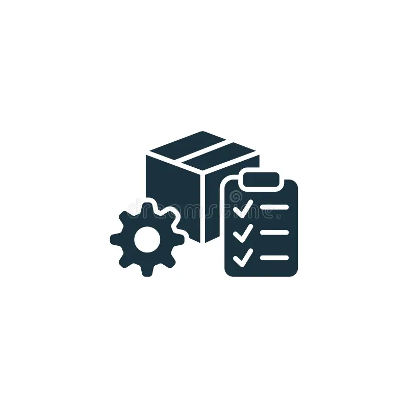

# CoreInventory
Inventory Management System for warehouse
# CoreInventory

> **A modern, full-stack Inventory Management System for warehouse operations — built with React + Flask.**



---

## ✨ Features

| Module | Description |
|---|---|
| **Dashboard** | Real-time metrics (Total Products, Quantity, Low Stock, Pending Adjustments), Inventory Value trend chart, and Recent Activity timeline |
| **Products** | Add, view, and manage product catalog with SKU, category, price, and stock quantities |
| **Receipts** | Track incoming goods with reference IDs, vendors, schedule dates, and status (Ready / Waiting / Late). List and Kanban views |
| **Delivery Orders** | Interactive customer dispatch form (Name, Address, Pin Code, Phone, Email) with live status tracking — Late, In Transit, Cancelled messages |
| **Transfers** | Money transaction tracking with Pending / In Process / Completed statuses, summary cards, and filterable tabs |
| **Inventory Adjustments** | Record and manage stock corrections and adjustments |
| **Warehouses** | Visual warehouse cards with location, manager, product count, and capacity usage bars |
| **Stock Ledger** | Complete history of all stock movements with date, reference, product, and quantity details |
| **Settings** | General config, Profile management, Notification preferences, Appearance (Light/Dark theme), and searchable Help & FAQ |

---

## 🛠️ Tech Stack

### Frontend
- **React 19** — UI library
- **Vite 8** — Build tool and dev server
- **Tailwind CSS 3** — Utility-first styling
- **React Router v7** — Client-side routing
- **Chart.js + react-chartjs-2** — Data visualization
- **Lucide React** — Icon system

### Backend
- **Flask** — Python web framework
- **Flask-SQLAlchemy** — ORM for database models
- **Flask-JWT-Extended** — Authentication with JSON Web Tokens
- **Flask-Migrate** — Database migrations
- **Flask-CORS** — Cross-Origin Resource Sharing
- **SQLite / PostgreSQL** — Database (SQLite for dev, PostgreSQL for production)

---

## 📁 Project Structure

```
CoreInventory/
├── backend/
│   ├── app.py              # Flask application entry point
│   ├── config.py           # App configuration
│   ├── models/             # Database models
│   ├── routes/             # API route handlers
│   ├── services/           # Business logic
│   ├── extensions/         # Flask extensions
│   ├── utils/              # Utility functions
│   └── tests/              # Backend tests
├── frontend/
│   ├── src/
│   │   ├── App.jsx         # Root component with routing
│   │   ├── main.jsx        # React entry point
│   │   ├── components/
│   │   │   └── Layout.jsx  # Sidebar + Topbar shell
│   │   ├── pages/
│   │   │   ├── Dashboard.jsx
│   │   │   ├── Products.jsx
│   │   │   ├── Receipts.jsx
│   │   │   ├── Deliveries.jsx
│   │   │   ├── Transfers.jsx
│   │   │   ├── Adjustments.jsx
│   │   │   ├── Warehouses.jsx
│   │   │   ├── Ledger.jsx
│   │   │   ├── Settings.jsx
│   │   │   ├── Login.jsx
│   │   │   └── Register.jsx
│   │   └── services/
│   │       └── api.js      # API client
│   ├── package.json
│   └── tailwind.config.js
├── requirements.txt
├── .gitignore
└── README.md
```

---

## 🚀 Getting Started

### Prerequisites
- **Node.js** v18+ and **npm**
- **Python** 3.9+

### 1. Clone the Repository
```bash
git clone https://github.com/yashvi-02/CoreInventory.git
cd CoreInventory
```

### 2. Backend Setup
```bash
# Create and activate virtual environment
python -m venv venv
venv\Scripts\activate        # Windows
# source venv/bin/activate   # macOS/Linux

# Install dependencies
pip install -r requirements.txt

# Run the Flask server
cd backend
python app.py
```
The API server will start on `http://127.0.0.1:5000`.

### 3. Frontend Setup
```bash
cd frontend
npm install
npm run dev
```
The dev server will start on `http://localhost:5173`.

---

## 🔐 Authentication

The app uses **JWT-based authentication**. Users can:
- **Register** a new account at `/register`
- **Log in** at `/login`
- Access protected pages only after authentication

---

## 📸 Pages Overview

| Page | Highlights |
|---|---|
| **Login / Register** | Clean auth forms with validation |
| **Dashboard** | 4 metric cards, inventory trend chart, activity timeline |
| **Products** | Full-width form + sortable product table |
| **Receipts** | List view with status badges, toggle to Kanban view |
| **Deliveries** | Customer form with address char-limit, pin/phone validation, clickable status badges with contextual messages |
| **Transfers** | Tab-filtered transaction table with summary cards |
| **Warehouses** | Color-coded cards with capacity progress bars |
| **Settings** | 5 tabs — General, Profile, Notifications, Appearance, Help & FAQ |

---

## 🤝 Contributing

1. Fork the repository
2. Create a feature branch (`git checkout -b feature/your-feature`)
3. Commit your changes (`git commit -m 'Add your feature'`)
4. Push to the branch (`git push origin feature/your-feature`)
5. Open a Pull Request

---

## 📄 License

This project is developed for educational and hackathon purposes.

---

**Built with ❤️ by the CoreInventory Team**